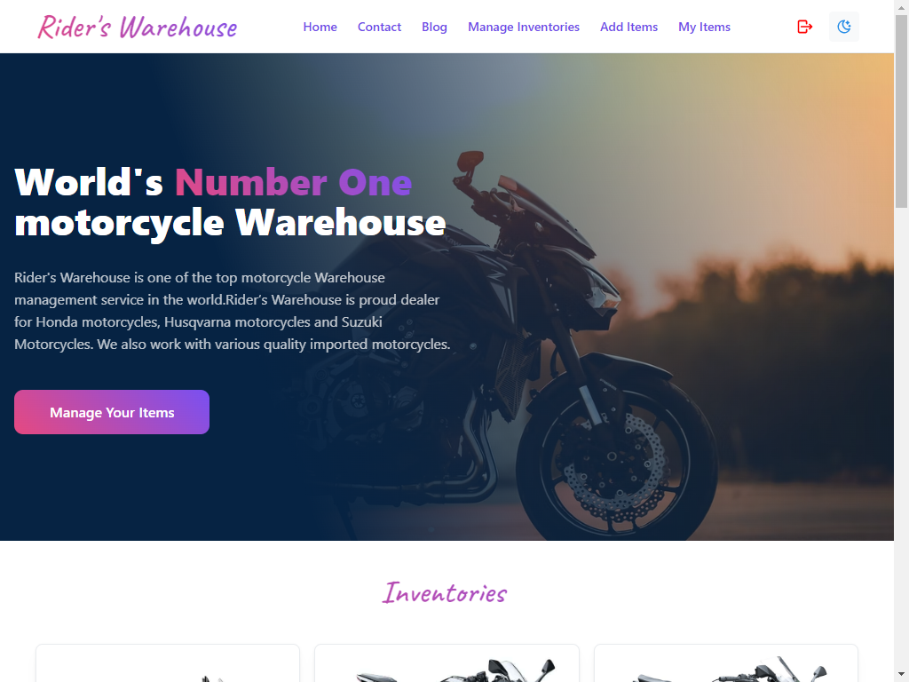
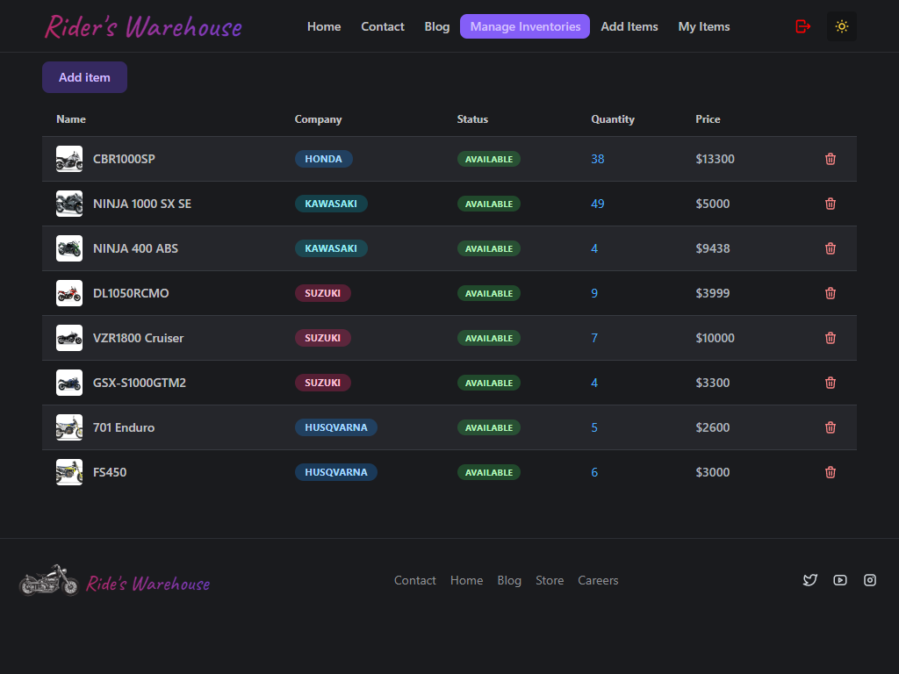

<h1 align="center">
    Rider's Warehouse
</h1>

## Inventory Management App built using React
----

 
<h2>
    Rider's Warehouse
</h2>

### An attempt to build full stack warehouse management app. Rider's Warehouse is a full stack web application that allows users to manage their inventory. It uses React for frontend and Node.js for backend. It also uses MongoDB for database.
----

 

----

## Main Features
------
- full stack app with react,  node, express, mongodb  and more
- Modern UI with Night Mode
- Responsive design With Mobile support
- Easy to use
- 100% secure and safe with jwt
- authentication with firebase and google sign in

### Technologies
----
- React
- Mantime UI [Mantime UI](https://mantine.dev/)
- Firebase
-  React Router
-  Axios
-  Tabler-Icon React

## Server - <a href="https://github.com/Saifurrahmanemon/Rider-s-Warehouse-server.git">Server Side Code</a>

### Plans
----
- 🧪 Write tests
- 🔍 Add More features

---

### Contributing Guide

If you want to contribute, improve or fix bugs in this repo, then check out the [Contributing Guide](./CONTRIBUTING.md)
 
